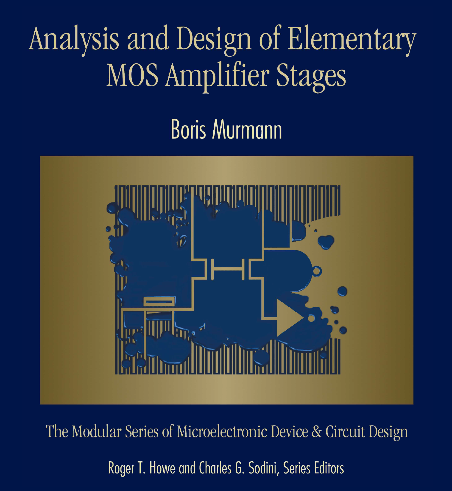

# Analysis and Design of Elementary MOS Amplifier Stages

Shield: [![CC BY 4.0][cc-by-shield]][cc-by]

[![CC BY 4.0][cc-by-image]][cc-by]

[cc-by]: http://creativecommons.org/licenses/by/4.0/
[cc-by-shield]: https://img.shields.io/badge/License-CC%20BY%204.0-lightgrey.svg



Copyright (c) 2013-2022 National Technology and Science Press  
Copyright (c) 2022 Boris Murmann

```
@book{murmann_mos_stages_2013, 
  title={Analysis and Design of Elementary MOS Amplifier Stages}, 
  author={Murmann, Boris}, 
  publisher={NTS Press}, 
  place={Allendale, NJ},
  year={2013},
}
```

Analog integrated circuit (IC) design is often viewed as a “black art,” accessible only to those with special talent or years of experience. As an attempt to disprove
this stereotype, this book was written to provide a customized introduction for the beginner with a minimum amount of prerequisite knowledge. Specifically, the material is positioned to fill the gap between general introductions on analog circuits, which are usually centered on discrete (printed circuit board) components, and advanced graduate books on integrated circuits. The need for filling the gap between these two types of texts has become stronger over the past decades for several reasons. The first is that advanced material has become less accessible for the inexperienced learner due to the growing complexity associated with the state of the art. A second reason is that today’s typical intro course sequence has been expanded to include embedded system design; this leaves very little time to cover analog circuit principles at a level that is required for advanced study.

There are multiple usage scenarios for this book. The material can be taught following an introduction to analog circuits in the junior or senior year of undergraduate study. In addition, the text can be used to prepare incoming graduate students for an advanced course sequence in analog IC design. Lastly, we believe that the book will be valuable for engineers that are pursuing a career change toward analog ICs, but do not possess the prerequisites to follow advanced literature. The reader of this module is expected to be familiar with the basic concepts of linear circuit analysis, including Kirchhoff’s laws and the frequency response analysis of passive networks. We also assume familiarity with basic solid-state physics and electrostatics.  

Since the study of analog circuits is strongly coupled to semiconductor device physics and linear system theory, it has and will always be difficult to teach this subject from the ground up, without causing too many distractions and challenges that are related to the required tool set, rather than the core principles themselves. This book follows a “just-in-time” treatment of semiconductor device modeling aspects to alleviate this problem. Instead of covering all of the detailed device physics in one isolated chapter, we begin with the simplest possible model, and augment this model only where needed to resolve new questions that arise as we learn more about circuits. This approach eases the device physics overhead and gives the reader a chance to internalize the transistor models from a well-motivated basis.

Chapter 1: Introduction  
Chapter 2: Transfer Characteristic of the Common-Source Voltage Amplifier  
Chapter 3: Frequency Response of the Common-Source Voltage Amplifier  
Chapter 4: The Common-Gate and Common-Drain Stages  
Chapter 5: Biasing Circuits  
Chapter 6: Multistage Amplifiers  
